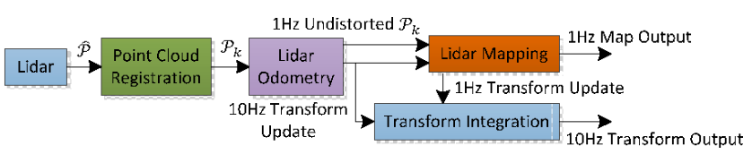
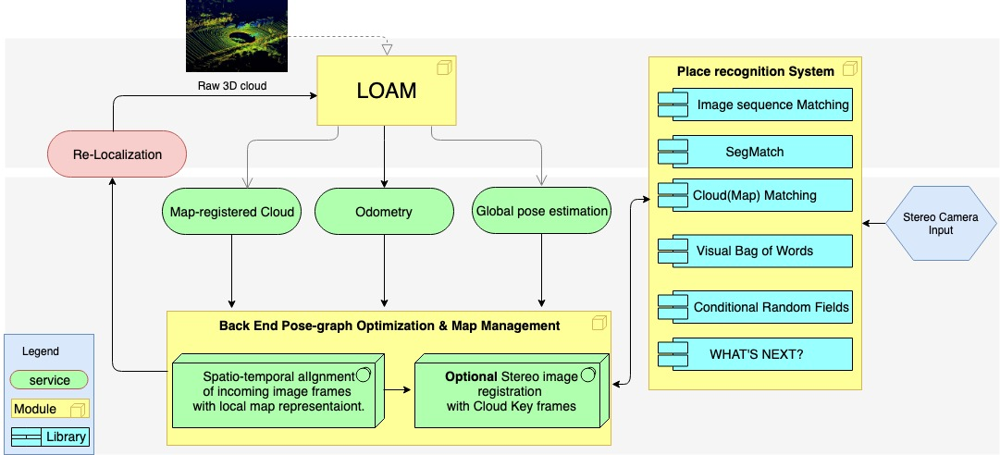

# L - SLAM Module

This is an implementation of the simultaneous localization and mapping (SLAM) solution for Lidar systems. The implementation is based on the method described in [this paper](https://www.ri.cmu.edu/publications/loam-lidar-odometry-and-mapping-in-real-time/) and aimed to be a stand-alone module to support any mobile Lidar systems and mostly Velodyne Lidar. This module is intended to be further enhanced to be a robust Lidar module with optional stereo image data input to support **accurate mapping**, **global loop closure** and **large-scale online SLAM** for challenging and complicated environment. 

P.S. This work is under the [Cooper Mapper](https://github.com/ZhekaiJin/the-Cooper-Mapper) Project.


## LOAM in a Nutshell
[Lidar Odometry and Mapping ](https://www.ri.cmu.edu/publications/loam-lidar-odometry-and-mapping-in-real-time/) is the state-of-the-art Lidar SLAM algorithm that can estimate odometry and construct a map simultaneously. It has keypoints granularity and needs data input from a 3D Lidar setup and optional IMU data. The algorithm can run in real-time in modest hardware. It can be summarized in the following steps:

1. Feature extraction: incoming point clouds are unwarped with inertial measurements. Plane and edge features are extracted.
2. Laser odometry (∼ 10 Hz): scan-to-scan odometry is estimated using strong features.
3. Laser mapping (∼ 1 Hz): scan-to-map odometry is estimated using strong features. All features extracted are registered with the latest odometry estimate, and the map is updated.
4. Transform integration: the motion estimates from the odometry and mapping modules are integrated.

The odometry and mapping modules estimate incremental transformations by employing a variant of point-to-point and point-to-plane ICP. For every pair of planar features belonging to different scans, a point-to-plane constraint is created. Similarly, point-to-point constraints are generated between edge features. Both sets of constraints are stacked into a matrix, and Singular Value Decomposition (SVD) is employed to estimate the optimal transformation.

## LOAM Software System Block Diagram



Block diagram of the Lidar odometry and mapping software system.

## Refactorization
* Refactor the work into modules
* Encapsulated repetitive code blocks
* Optimized data structure usage
* Avoid hard coding and Support **custom configuration**

## Extension
* Support **Map Management** module
* Support **Re-Localization** module
* Referred to [Google Cartographer](https://github.com/googlecartographer/cartographer) for some module development
* Support ROS nodelet to avoid extra data & memory copying cost

## Prerequisites

### Hardware
* A 3D Velodyne-like Lidar
* A mobile power source.
* A mobile computing platform if you want to run the algorithm in real time

### Software

* ROS Kinetic or Later.
* PCL, g2o, Eigen


## Build (this Module Only)
```
git clone https://github.com/ZhekaiJin/the-Cooper-Mapper.git
cp the-Cooper-Mapper/smartbot/L_SLAM/ your_ros_working_space/src
cd your_ros_working_space
catkin_make -j4
```
## LSLAM Block Diagram



*Block diagram of the Cooper Mapper Project's Fusion Pipeline* 
(not fully implemented yet)


## Versioning

This work use [SemVer](http://semver.org/) for versioning. This repo now contains version 1.0.

## Acknowledgments

* **Ji Zhang** and **Sanjiv Singh** - *LOAM* - [LOAM](https://www.ri.cmu.edu/publications/loam-lidar-odometry-and-mapping-in-real-time/)

## Authors
**Zhekai Jin**

## License

This project is licensed under the MIT License - see the [LICENSE](../../LICENSE) file for details.
