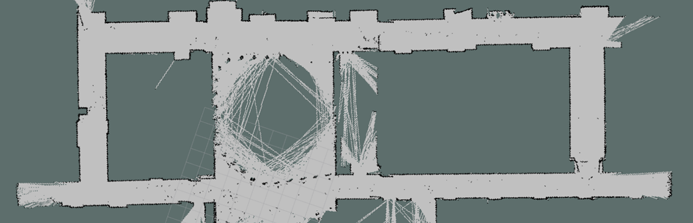
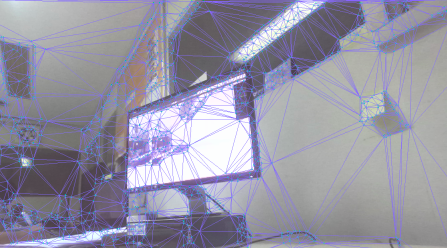
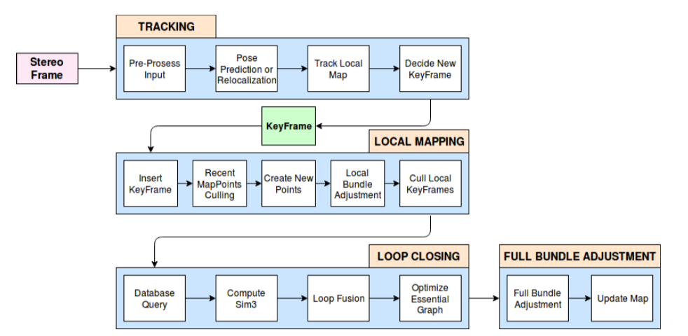

# The Cooper Mapper

The Cooper Mapper is an interdisplinary research project conducted at Cooper Union aiming to investigate the multisensor data fusion problem, specifically on the topic of Simultaneous Localization and Mapping (SLAM).

## Vision
Visual SLAM pipelines are more robust in dynamic scenes, and computationally less expensive, but extremely sensitive to changes in illumination and appearance. On the other hand, LiDAR SLAM systems work more consistently over changes in lighting conditions or seasons, by exploiting the geometric structure of the world. Our work focuses on methods that fully leverage the advantages of Lidar and Camera to improve the **accuracy, robustness and efficency** of SLAM such as place recognition techniques. We look specifically at problems like real-time loop closures, global localization, sensor degeneracy problems.

## Hardware

* RPLidar2 laser range finder
* custom-tilt device for the planar Lidar
* Stereolabs ZED stereo camera
* Jetson TX2
* Sparkfun IMU

*Our 2D mapping Setup* (3D Lidar Scanner not shown)

## Experimental Results

### 2D Lidar SLAM

This is the experimental run of our Lidar SLAM 2D algorithm based on [Gmapping](https://ieeexplore.ieee.org/document/4084563).

*Running in the Cooper Union 6th floor*

This is the ground truth floor planning map for Cooper Union 6th Floor.

*floor planning map*

### Visual SLAM & 3D Reconstruction

We implemented Visual SLAM algorithms based on [ORB-SLAM2](https://arxiv.org/abs/1610.06475) and [ZED API](https://www.stereolabs.com/docs/api/) at the [SMAC2](https://engfac.cooper.edu/nshlayan/689) Lab.

#### Stereo Matching Algorithms
We adapted the Bayesian based stereo matching algorithm ([ELAS](https://link.springer.com/chapter/10.1007/978-3-642-19315-6_3)) on our platform.

ELAS stands for Efficient LArge scale Stereo. ELAS proposed a Bayesian-based probabilistic generative model. Robustly matched points are searched first, and the disparity is calculated for them. ELAS termed these points support points. Then a prior is built using disparity values of support points by forming a Delaunay Triangulation on them. 

*Elas Support Points and Delauny Triangles*

#### ORB-SLAM2
ORB-SLAM2 extends ORB-SLAM to allow the usage of an RGB-D/stereo camera instead of a monocular camera. Like its predecessor, it uses three threads that work in parallel. First, the tracking thread matches the local map with the extracted features for every frame and minimizes the reprojection error to localize the camera for each frame. The second thread local mapping is used to optimize and manage the local map through local bundle adjustment optimization. The third thread loop closing performs pose-graph optimization to correct drift and detect loops. A new feature in ORB-SLAM2 is that in the loop closing thread a fourth thread is initialized, which operates a full bundle adjustment of the entire map to achieve an optimized and consistent reconstruction of the environment. 

ORB-SLAM2 employs a visual bag-of-words model (VBoW), which performs place recognition utility. (loop closure)  VBoW is used in Loop detection; If there is already a mapped local map, the system reinitializes itself, and if the system has lost track of where it is, it relocalizes itself. Another important feature of ORB-SLAM2 is the covisibility-graph, which is used to link two keyframes that have similar observations of points. The graph is used to define a local neighborhood which enables the tracking and mapping to work locally.

We implemented ORB-SLAM2 with ZED API and are planning to add the visual signature idea into the-state-of-art Lidar SLAM algorihtm (LOAM) to improve the accuracy of mapping and introduce **global loop closure** into LOAM.

*3D surface reconstruction of SMAC2 Lab (click on the image to view the model)*

### Continuous-Time SLAM

We are constructing a 3D Lidar from the RPLidar2 by attaching it on a tilt unit with a rotating mechanism (or we can get a Velodyne-16 with external funding) and are planning to extend the LOAM module to integrate Lidar and Visual SLAM methods. Our fundamental idea is to allow optional image registration (timestamps-based) with Lidar keyframes and to use the-state-of-art dense matching and SegMatch modules for place recognition and loop closure. We have extended and adapted the LOAM module to our system and please refer to the [**L-SLAM Submodule**](L_SLAM/) for details.

## Block Diagram

*Block diagram of the Cooper Mapper Project*

## Acknowledgments

* Thanks for the mentorship and support from
**Dr. Carl Sable**,
**Dr. Neveen Shlayan**,
**Dr. Dirk Luchtenburg**,
**Mr. Lu Zou**.

## Versioning

This work use [SemVer](http://semver.org/) for versioning. This repo now contains version 1.0.

## Authors
**Zhekai Jin**, **Simon Shao**, **Minjoon So**

## License

This project is licensed under the MIT License - see the [LICENSE](LICENSE) file for details.
