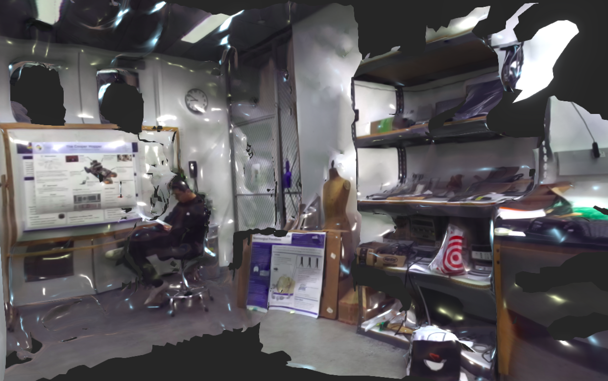

# The Cooper Mapper

The Cooper Mapper is an interdisplinary research project conducted at Cooper Union aiming to investigate the multisensor data fusion problem, specifically on the topic of Simultaneous Localization and Mapping (SLAM). 

## Vision 
Visual SLAM pipelines are more robust in dynamic scenes, and computationally less expensive, but extremely sensitive to changes in illumination and appearance. On the other hand, LiDAR SLAM systems work more consistently over changes in lighting conditions or seasons, by exploiting the geometric structure of the world. Our work focuses on methods that fully leverage the advantages of Lidar and Camera to improve the **accuracy, robustness and efficency** of SLAM such as place recognition techniques. We look specifically at problems like real-time loop closures, global localization, sensor degeneracy problems. 

## Hardware

* RPLidar2 laser range finder 
* custom-tilt device for the planar Lidar
* Stereolabs ZED stereo camera
* Jetson TX2
* Sparkfun IMU 

*Our 2D mapping Setup* (3D Lidar Scanner not shown)

## Experimental Results 

### 2D Lidar SLAM

This is the experimental run of our Lidar SLAM 2D algorithm based on [Gmapping](https://ieeexplore.ieee.org/document/4084563).

*Running in the Cooper Union 6th floor*

This is the ground truth floor planning map for Cooper Union 6th Floor.

*floor planning map*

### 3D Reconstruction

This is the surface reconstruction of [SMAC2](https://engfac.cooper.edu/nshlayan/689) based on [ORB-SLAM2](https://arxiv.org/abs/1610.06475) and [ZED API](https://www.stereolabs.com/docs/api/).

*Elas Support Points and Delauny Triangles*

*SMAC2 Lab*

### Continuous-Time SLAM 

We are constructing a 3D Lidar from the RPLidar2 by attaching it on a tilt unit with a rotating mechanism and are planning to extend the LOAM module to integrate Lidar and Visual SLAM methods. We have extended and adapted the LOAM module to our system and please refer to the [L-SLAM submodule](L_SLAM/README.md) for details.

## Block Diagram

*Block diagram of the Cooper Mapper Project*

## Acknowledgments

* Thanks for the mentorship and support from 
**Dr. Carl Sable**,
**Dr. Neveen Shlayan**,
**Dr. Dirk Luchtenburg**,
**Mr. Lu Zou**.

## Versioning

This work use [SemVer](http://semver.org/) for versioning. This repo now contains version 1.0. 

## Authors
**Zhekai Jin**, **Simon Shao**, **Minjoon So**

## License

This project is licensed under the MIT License - see the [LICENSE](LICENSE) file for details.

