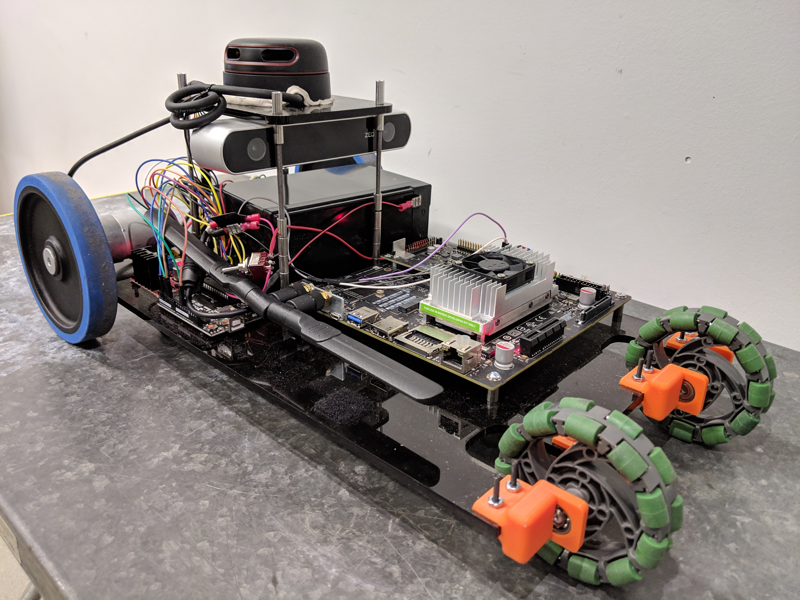
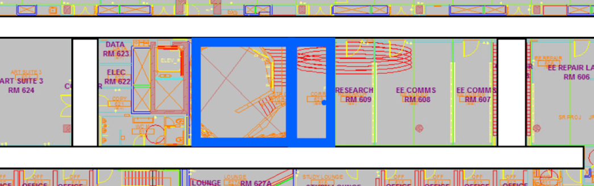

# L - SLAM Module

This is a implementation of the simultaneous localization and mapping (SLAM) solution for Lidar systems. The implementation is based on the method described [here](https://www.ri.cmu.edu/publications/loam-lidar-odometry-and-mapping-in-real-time/) and aims to be a stand-alone module to support any mobile Lidar systems and mostly Velodyne LiDAR. 




## Prerequisites

### Hardware
* A Lidar 
* A movable power source.
* A mobile computing platform if you want to run the algorithm in real time

### Software

* ROS Kinetic or Later.
* PCL, g2o, Eigen 


## Build (this Module Only)
```
git clone https://github.com/ZhekaiJin/the-Cooper-Mapper.git
cp the-Cooper-Mapper/smartbot/L_SLAM/ your_ros_working_space/src
cd your_ros_working_space
catkin_make -j4
```	

## Experimental Results 

### Running in the Cooper Union 6th floor
This is the experimental run on Cooper Union with our algorithm.


This is the ground truth floor planning for Cooper Union 6th Floor.




## Block Diagram


Block diagram of the lidar odometry and mapping software system.

## Versioning

This work use [SemVer](http://semver.org/) for versioning. This repo now contains version 1.0. 

## Authors
**Zhekai Jin** 

## License

This project is licensed under the MIT License - see the [LICENSE](../../LICENSE) file for details.

## Acknowledgments

* **Ji Zhang** and **Sanjiv Singh** - *LOAM* - [PurpleBooth](https://www.ri.cmu.edu/publications/loam-lidar-odometry-and-mapping-in-real-time/)


